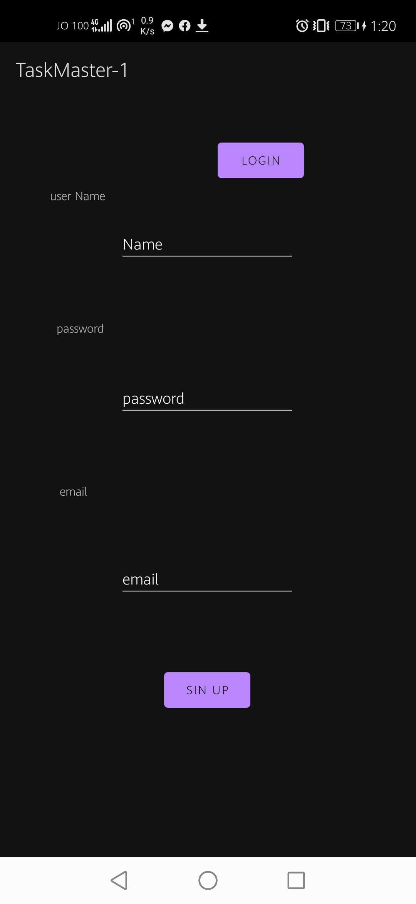
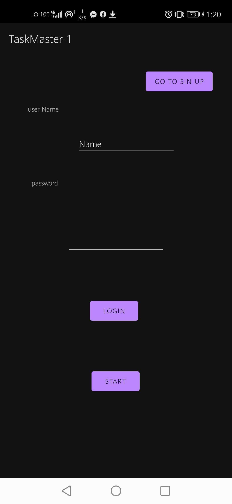
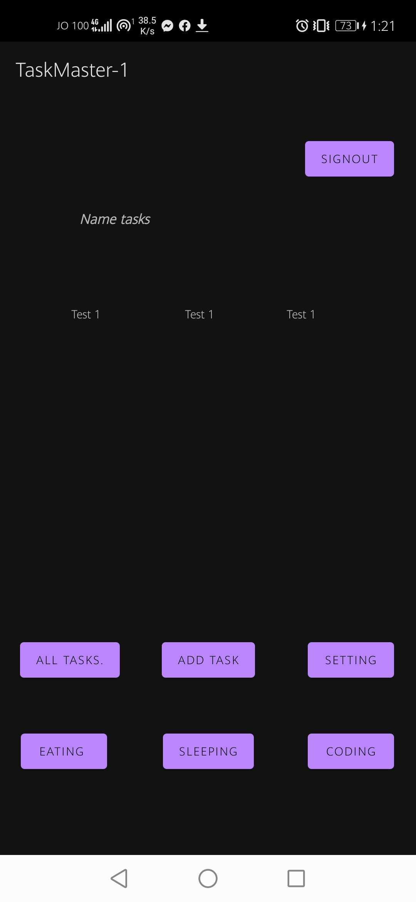
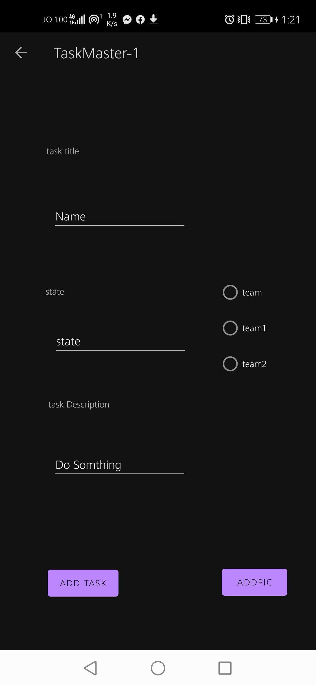
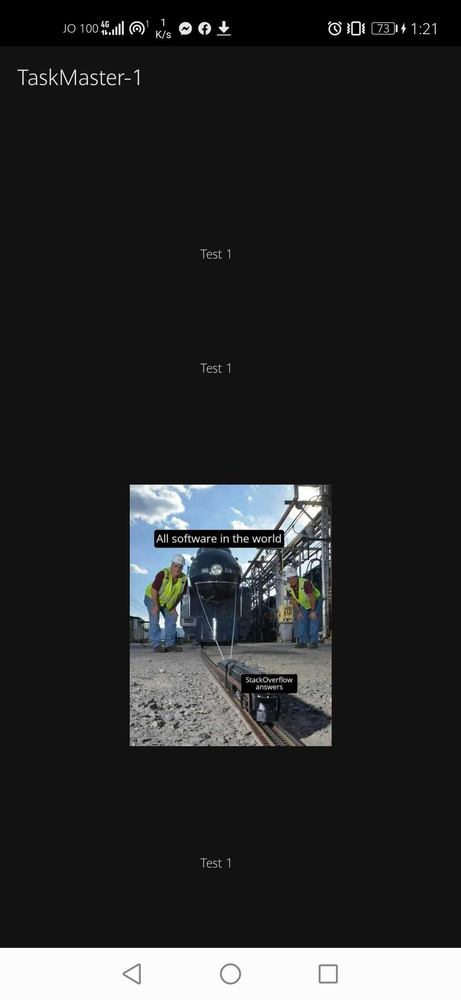

# taskmaster-1

## Task Model and Room
- ### Following the directions provided in the Android documentation, set up Room in your application, and modify your Task class to be an Entity.

- ### Add Task Form Modify your Add Task form to save the data entered in as a Task in your local database.

- ### Homepage Refactor your homepage’s RecyclerView to display all Task entities in your database.

- ### Detail Page Ensure that the description and status of a tapped task are also displayed on the detail page, in addition to the title. (Note that you can accomplish this by passing along the entire Task entity, or by passing along only its ID in the intent.)

## Espresso Testing

### Add Espresso to your application, and use it to test basic functionality of the main components of your application. For example:

- ### assert that important UI elements are displayed on the page
- ### tap on a task, and assert that the resulting activity displays the name of that task
- ### edit the user’s username, and assert that it says the correct thing on the homepage

## Amplify and DynamoDB
- ### Add Task Form Modify your Add Task form to save the data entered in as a Task to DynamoDB.
- ### Homepage Refactor your homepage’s RecyclerView to display all Task entities in DynamoDB.

## Tasks Are Owned By Teams
- ### Create a second entity for a team, which has a name and a list of tasks. Update your tasks to be owned by a team.

- ### Manually create three teams by running a mutation exactly three times in your code. (You do NOT need to allow the user to create new teams.)

## Add Task Form
- ### Modify your Add Task form to include either a Spinner or Radio Buttons for which team that task belongs to.

## Settings Page
- ### In addition to a username, allow the user to choose their team on the Settings page. Use that Team to display only that team’s tasks on the homepage.

## User Login
### Add Cognito to your Amplify setup. Add in user login and sign up flows to your application, using Cognito’s pre-built UI as appropriate. Display the logged in user’s username somewhere relevant in your app.

## User Logout
## Allow users to log out of your application.

## Uploads
### On the “Add a Task” activity, allow users to optionally select a file to attach to that task. If a user attaches a file to a task, that file should be uploaded to S3, and associated with that task.

## Displaying Files
###  On the Task detail activity, if there is a file that is an image associated with a particular Task, that image should be displayed within that activity. (If the file is any other type, you should display a link to it.)

